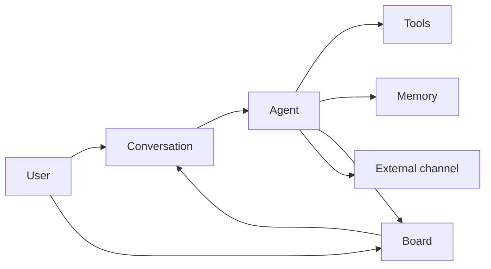

EYAS is not a single chatbot window. It is a **personal AI operating system**: named agents, durable memory, a work board, automation, and multi-channel I/O on your machine.

## Building blocks

| Concept | What it is | Where in UI |
|---------|------------|-------------|
| **Agent** | Named AI actor with model, tools, skills, voice, workspace files, optional channels | Agents |
| **Primary agent** | Always-on teammate from setup (Personal Assistant + System Engineer) | Agents (tier: Primary) |
| **Team / specialist agent** | Extra capacity; often receives delegated work | Agents |
| **Conversation** | Message thread with one or more agents; tool calls, runs, context rail | New Conversation / chat |
| **Board card** | Trackable work item; often linked to a conversation | Board |
| **Project / stage** | Delivery structure; conversations can sit on stages | Projects |
| **Skill** | Reusable markdown procedure pack agents can load | Skills |
| **Tool** | Invokable capability (shell, browser, APIs, MCP…) with permissions | Tools / agent config |
| **Memory** | Hybrid recall: working → episodic → semantic/procedural → archive + vault files | Memory |
| **Knowledge page** | Explicit wiki page you edit (not automatic memory) | Knowledge |
| **Document** | Uploaded file indexed for retrieval | Documents |
| **Channel** | External inbox/outbox (e.g. Telegram) bound to an agent | Communication |
| **Provider** | LLM backend (cloud API, host CLI, or local runtime) | Providers |
| **Prompt chain** | master → project-type → project → conversation layers | Prompts / Settings |
| **Security gate** | Policy checks before dangerous actions | Security |
| **Forge** | Human-approved proposals to evolve agent soul/identity | Forge |

## Typical flow

1. **Setup** creates owner, primaries, provider  
2. You open a **conversation** or create a **board** card  
3. The agent may use **tools/skills**, write **memory**, **delegate**, or answer on a **channel**  
4. You review results in chat, board, documents, or outbound messages  

## Agent vs conversation vs card

| | Agent | Conversation | Board card |
|--|-------|--------------|------------|
| Lifetime | Long-lived configuration | Thread of messages | Work tracking unit |
| “Who” | Persona + tools + memory | Session of talk | Task state |
| Change often? | Settings, forge, workspace | Every message | Status, assignee, due date |

## Memory vs knowledge vs documents

| Store | Who writes it | Best for |
|-------|---------------|----------|
| **Memory tiers** | System / agents during work | Automatic recall, episodes, procedures |
| **Vault markdown** | Import / agents / you | Long-lived semantic & procedural notes |
| **Knowledge base** | You (editor) | Curated wiki |
| **Documents** | Upload | PDFs, office files, source dumps |

## Orchestration (conversation fields)

When chatting you may see controls such as:

| Control | Meaning |
|---------|---------|
| **Effort** | Reasoning depth vs cost/speed |
| **Orchestration: Solo** | No sub-agents |
| **Orchestration: Auto** | Model decides fan-out |
| **Orchestration: Deep** | Aggressive multi-agent fan-out |

Details: [Conversations](/docs/en/daily/conversations/).

## Security mental model

- **Root owner** — human admin account  
- **Master password** — encrypts Secrets store  
- **CASL permissions** — what each user/agent may do  
- **Security gate** — runtime checks on risky tool use  
- **Autonomy flags** — how much agents may do without asking  

## Next reading

- [Getting started](/docs/en/getting-started/)
- [Agents overview](/docs/en/agents/overview/)
- [Memory](/docs/en/knowledge/memory/)
- [Architecture pointer](/docs/en/reference/architecture/) (deep technical specs in the repo)
