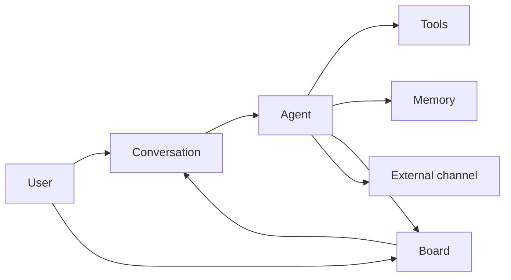

EYAS n’est pas une simple fenêtre de chatbot. C’est un **système d’exploitation d’IA personnelle** : agents nommés, mémoire durable, tableau de travail, automatisation et E/S multi-canal sur votre machine.

## Blocs de construction

| Concept | Ce que c’est | Où dans l’UI |
|---------|--------------|--------------|
| **Agent** | Acteur IA nommé avec modèle, outils, compétences, voix, fichiers d’espace de travail, canaux facultatifs | Agents |
| **Agent principal** | Coéquipier toujours actif issu de la configuration (Assistant personnel + Ingénieur système) | Agents (niveau : Principal) |
| **Agent d’équipe / spécialiste** | Capacité supplémentaire ; reçoit souvent du travail délégué | Agents |
| **Conversation** | Fil de messages avec un ou plusieurs agents ; appels d’outils, exécutions, rail de contexte | Nouvelle conversation / chat |
| **Carte du tableau** | Élément de travail suivable ; souvent lié à une conversation | Tableau |
| **Projet / étape** | Structure de livraison ; les conversations peuvent siéger sur des étapes | Projets |
| **Compétence** | Paquet de procédures markdown réutilisable que les agents peuvent charger | Compétences |
| **Outil** | Capacité invocable (shell, navigateur, API, MCP…) avec permissions | Outils / config agent |
| **Mémoire** | Rappel hybride : travail → épisodique → sémantique/procédural → archive + fichiers du coffre | Mémoire |
| **Page de connaissances** | Page wiki explicite que vous éditez (pas une mémoire automatique) | Connaissances |
| **Document** | Fichier téléversé indexé pour la recherche | Documents |
| **Canal** | Boîte d’entrée/sortie externe (p. ex. Telegram) liée à un agent | Communication |
| **Fournisseur** | Backend LLM (API cloud, CLI hôte ou runtime local) | Fournisseurs |
| **Chaîne de prompts** | couches master → type de projet → projet → conversation | Prompts / Paramètres |
| **Porte de sécurité** | Contrôles de politique avant les actions dangereuses | Sécurité |
| **Forge** | Propositions approuvées par l’humain pour faire évoluer l’âme/identité de l’agent | Forge |

## Flux typique

1. La **configuration** crée le propriétaire, les agents principaux, le fournisseur  
2. Vous ouvrez une **conversation** ou créez une carte du **tableau**  
3. L’agent peut utiliser des **outils/compétences**, écrire dans la **mémoire**, **déléguer**, ou répondre sur un **canal**  
4. Vous relisez les résultats dans le chat, le tableau, les documents ou les messages sortants  

## Agent vs conversation vs carte

| | Agent | Conversation | Carte du tableau |
|--|-------|--------------|------------------|
| Durée de vie | Configuration durable | Fil de messages | Unité de suivi du travail |
| « Qui » | Persona + outils + mémoire | Session d’échange | État de la tâche |
| Change souvent ? | Paramètres, forge, espace de travail | Chaque message | Statut, assigné, échéance |

## Mémoire vs connaissances vs documents

| Magasin | Qui l’écrit | Idéal pour |
|---------|-------------|------------|
| **Niveaux de mémoire** | Système / agents pendant le travail | Rappel automatique, épisodes, procédures |
| **Markdown du coffre** | Import / agents / vous | Notes sémantiques et procédurales durables |
| **Base de connaissances** | Vous (éditeur) | Wiki organisé |
| **Documents** | Téléversement | PDF, fichiers bureautiques, dumps de sources |

## Orchestration (champs de conversation)

Lorsque vous discutez, vous pouvez voir des commandes telles que :

| Commande | Signification |
|----------|---------------|
| **Effort** | Profondeur de raisonnement vs coût/vitesse |
| **Orchestration : Solo** | Pas de sous-agents |
| **Orchestration : Auto** | Le modèle décide du déploiement |
| **Orchestration : Deep** | Déploiement multi-agent agressif |

Détails : [Conversations](/docs/fr/daily/conversations/).

## Modèle mental de sécurité

- **Propriétaire racine** — compte administrateur humain  
- **Mot de passe maître** — chiffre le magasin Secrets  
- **Permissions CASL** — ce que chaque utilisateur/agent peut faire  
- **Porte de sécurité** — contrôles d’exécution sur l’usage risqué des outils  
- **Indicateurs d’autonomie** — jusqu’où les agents peuvent aller sans demander  

## Lectures suivantes

- [Premiers pas](/docs/fr/getting-started/)
- [Vue d’ensemble des agents](/docs/fr/agents/overview/)
- [Mémoire](/docs/fr/knowledge/memory/)
- [Renvoi architecture](/docs/fr/reference/architecture/) (spécifications techniques détaillées dans le dépôt)
