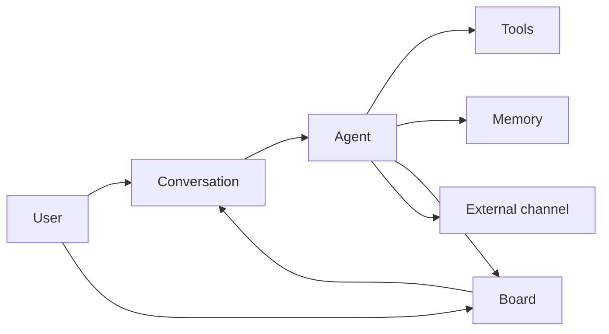

Olvasd el egyszer [Az első órád](/docs/hu/first-hour/) után. Gyere vissza, ha egy későbbi fejezet olyan szót használ, amit nem ismersz. Ez a mentális modell, nem képernyőnkénti útmutató.

Az EYAS nem egyetlen chatbot ablak. **Személyes AI operációs rendszer**: elnevezett ágensek, tartós memória, munkatábla, automatizálás és többcsatornás I/O a te gépeden.

## Építőelemek

| Fogalom | Mi ez | Hol a UI-n |
|---------|-------|------------|
| **Ágens** | Elnevezett AI szereplő: modell, toolok, skillek, hang, workspace, csatornák | Agentek |
| **Primary ágens** | Always-on társ a setupból (Személyi asszisztens + Rendszermérnök) | Agentek (Elsődleges) |
| **Team / specialist** | Extra kapacitás; gyakran delegált munka | Agentek |
| **Beszélgetés** | Üzenetfolyam; tool hívások, runok, context rail | Új beszélgetés / chat |
| **Tábla kártya** | Követhető munkaegység; gyakran beszélgetéshez kötve | Tábla |
| **Projekt / stage** | Szállítási struktúra | Projektek |
| **Skill** | Újrahasználható markdown eljáráscsomag | Készségek |
| **Tool** | Hívható képesség jogosultságokkal | Eszközök / ágens config |
| **Memória** | Working → episodic → semantic/procedural → archive + vault | Memória |
| **Tudásoldal** | Általad szerkesztett wiki (nem automatikus memória) | Tudásbázis |
| **Dokumentum** | Feltöltött, indexelt fájl | Dokumentumok |
| **Csatorna** | Külső be/kimenet (pl. Telegram) ágenshez kötve | Kommunikáció |
| **Provider** | LLM backend | Providerek |
| **Prompt lánc** | master → project-type → project → conversation | Promptok |
| **Security gate** | Policy veszélyes műveletek előtt | Biztonság |
| **Forge** | Ember által jóváhagyott soul/identity javaslatok | Forge |

## Tipikus folyamat

1. **Setup** — owner, primary ágensek, provider
2. **Beszélgetés** vagy **tábla** kártya
3. Ágens: **tool/skill**, **memória**, **delegálás**, **csatorna**
4. Eredmény: chat, tábla, dokumentumok, kimenő üzenet

## Ágens vs beszélgetés vs kártya

| | Ágens | Beszélgetés | Tábla kártya |
|--|-------|-------------|--------------|
| Élettartam | Hosszú távú config | Üzenetfolyam | Munkakövetés |
| „Ki / mi” | Persona + toolok | Beszélgetés session | Feladat állapot |
| Gyakran változik? | Beállítás, forge | Minden üzenet | Státusz, határidő |

## Memória vs tudás vs dokumentum

| Tár | Ki írja | Mire jó |
|-----|---------|---------|
| **Memória szintek** | Rendszer / ágensek munka közben | Automatikus felidézés |
| **Vault markdown** | Import / ágens / te / **auto-capture egy beszélgetés-forduló után** (alapból bekapcsolva a 0.8.16-beta óta) | Hosszú távú jegyzetek |
| **Tudásbázis** | Te (szerkesztő) | Kurált wiki |
| **Dokumentumok** | Feltöltés | PDF, office, forrás dump |

Egy tartós tény, amit chatben kimondasz, vault jegyzet lehet anélkül, hogy bárki kérné. A capture a válasz kézbesítése után fut; a sikertelen capture egy jegyzetet veszít, soha nem a választ. Részletek: [Memória](/docs/hu/knowledge/memory/).

## Orchestráció (beszélgetés mezők)

| Vezérlő | Jelentés |
|---------|----------|
| **Effort** | Gondolkodási mélység vs költség/sebesség |
| **Solo** | Nincs sub-agent |
| **Auto** | A modell dönt a fan-out-ról |
| **Deep** | Agresszív többágenses fan-out |

Részletek: [Beszélgetések](/docs/hu/daily/conversations/).

## Biztonsági kép

- **Root owner** — emberi admin
- **Mesterjelszó** — Secrets titkosítás
- **CASL** — mit tehet a user/ágens
- **Security gate** — runtime ellenőrzés
- **Autonómia** — mennyit tehet megkérdezés nélkül

## Tovább

- [Az első órád](/docs/hu/first-hour/)
- [Első lépések](/docs/hu/getting-started/)
- [Ágensek](/docs/hu/agents/overview/)
- [Memória](/docs/hu/knowledge/memory/)
- [Architektúra mutató](/docs/hu/reference/architecture/)
