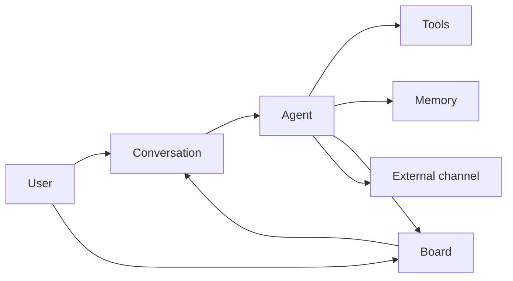

EYAS wa' ja'chuq qach neH 'oHbe'. **jIH AI Qap pat** 'oH: ponglu'bogh ghoqwI'pu', taH qawHaq, Qu' nav, QapchoH, He law' 'el/mej De'wI'lIjDaq.

## chenmoHwI'mey

| qech | nuq 'oH | UIDaq nuqDaq |
|------|---------|--------------|
| **ghoqwI'** | ponglu'bogh AI vumwI' — pat, janmey, laHmey, ghogh, vum Daq teDwI'mey, poQbe' Hemey | ghoqwI'pu' |
| **potlh ghoqwI'** | lIngvo' reH Qapbogh ghom lo'wI' (jIH QaHwI' + pat QanwI') | ghoqwI'pu' (patlh: potlh) |
| **ghom / laHwI' ghoqwI'** | latlh HoS; motlh nobHa'lu'bogh Qu' Suq | ghoqwI'pu' |
| **ja'chuq** | wa' pagh law' ghoqwI'pu'vaD QIn tlhegh; jan ra', QaptaH, De' He | chu' ja'chuq / ja' |
| **Qu' nav chovnatlh** | tlha'laHbogh Qu'; motlh ja'chuqDaq rar | Qu' nav |
| **Qu' / mIw qach** | nob mIw; mIw qachDaq ba'laH ja'chuqmey | Qu'mey |
| **laH** | ghoqwI'pu' qenglaHbogh qa' markdown tIgh ngaS | laHmey |
| **jan** | ra'laHbogh laH (shell, qunI'wI', API, MCP…) chaw'mey je | janmey / ghoqwI' SeH |
| **qawHaq** | ngaj qaw: vum → qaS → QIj/tIgh → ngaS + toDpa' teDwI'mey | qawHaq |
| **Sov pa'** | SoH choHbogh wiki pa' (autom qawHaq 'oHbe') | Sov |
| **ghItlh** | nejvaD tetlhlu'bogh lIng teDwI' | ghItlhmey |
| **He** | Hur 'el/'ej mej (Telegram) ghoqwI'Daq rar | Qum |
| **nobwI'** | LLM 'emDaq (chal API, juH CLI, pagh juH Qap) | nobwI'pu' |
| **mu'tlhegh tlhegh** | potlh → Qu' Segh → Qu' → ja'chuq patlhmey | mu'tlheghmey / SeHmey |
| **Hub lojmIt** | Qatlh ta'mey pa' chut chov | Hub |
| **Forge** | ghoqwI' qa'/pong choHmeH Human chaw' chupmey | Forge |

## motlh ghoS

1. **lIng** pIn, potlh ghoqwI'pu', nobwI' chenmoH  
2. **ja'chuq** DapoSmoH pagh **Qu' nav** chovnatlh Dachu'  
3. **janmey/laHmey** lo'laH ghoqwI', **qawHaq** ghItlhlaH, **nobHa'laH**, pagh **He**Daq jang  
4. ja'Daq, Qu' navDaq, ghItlhmeyDaq, pagh mej QInmeyDaq qaS tIchov  

## ghoqwI' ja'chuq chovnatlh je

| | ghoqwI' | ja'chuq | Qu' nav chovnatlh |
|--|---------|---------|-------------------|
| yIn poH | tIq SeH | QIn tlhegh | Qu' tlha' wa' |
| «'Iv» | ghaH + janmey + qawHaq | ja' poH | Qu' Dotlh |
| pIj choH'a'? | SeHmey, Forge, vum Daq | Hoch QIn | Dotlh, Qu'wI', poH |

## qawHaq Sov ghItlhmey je

| pa' | 'Iv ghItlh | QaQ |
|-----|------------|-----|
| **qawHaq patlhmey** | pat / ghoqwI'pu' vumtaHvIS | autom qaw, qaS, tIghmey |
| **toDpa' markdown** | lIng / ghoqwI'pu' / SoH | tIq QIj 'ej tIgh ghItlhHommey |
| **Sov pa'** | SoH (choHwI') | wIvlu'bogh wiki |
| **ghItlhmey** | lIng | PDF, Qu' teDwI'mey, mo' ngaS |

## ghom SeH (ja'chuq De'mey)

ja'taHvIS SeHwI'meyvam leghlaH:

| SeHwI' | QIj |
|--------|-----|
| **vum** | Qub chIl vs Huch/nom |
| **ghom SeH: nIH** | latlh ghoqwI' pagh |
| **ghom SeH: autom** | pat He law' wuq |
| **ghom SeH: chIl** | HoS ghom ghoqwI' He law' |

De': [ja'chuqmey](/docs/tlh/daily/conversations/).

## Hub yaj qech

- **potlh pIn** — Human pIn lo'wI'  
- **potlh pegh mu'** — pegh pa' So'  
- **CASL chaw'mey** — Hoch lo'wI'/ghoqwI' ta'laHbogh  
- **Hub lojmIt** — Qatlh jan lo'Daq Qap poH chov  
- **SeH'egh per** — ghoqwI'pu' tlhobbe'taHvIS 'ar ta'laH  

## veb laD

- [tagh](/docs/tlh/getting-started/)
- [ghoqwI'pu' Hoch Del](/docs/tlh/agents/overview/)
- [qawHaq](/docs/tlh/knowledge/memory/)
- [pat De' He](/docs/tlh/reference/architecture/) (qunDaq HoS pat chovnatlhmey)
